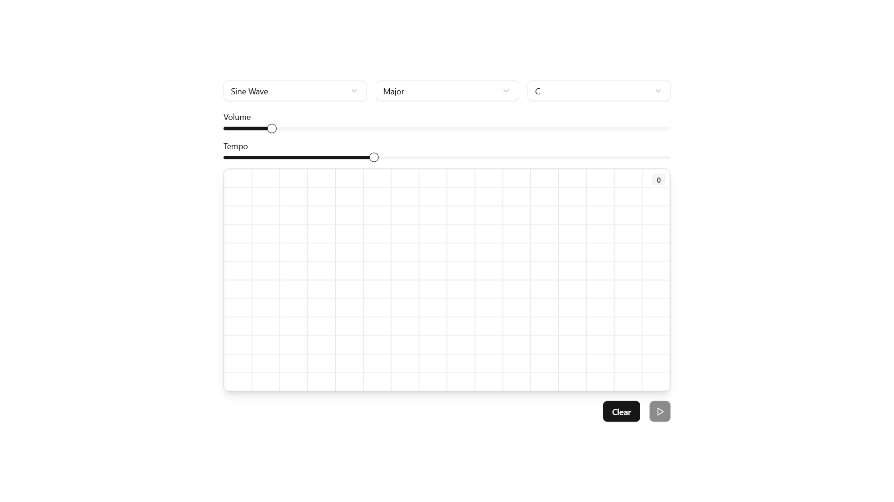

# 🎵 Sound Sketch – Draw with Sound ✍️

**Sound Sketch** is a creative web app where users can "draw" musical notes on a canvas. Each stroke represents a unique sound, with customizable instruments, scales, and notes. Once drawn, users can playback their sketch and listen to their musical creation.

## 🚀 Features

- 🎨 **Canvas-based drawing** – Draw strokes that generate musical notes.
- 🎵 **Sound playback** – Play and stop the generated music.
- 🎛 **Customizable sounds**:
  - **Instrument types**: Sine Wave, Square Wave, Sawtooth, Triangle
  - **Musical scales**: Major, Minor, Pentatonic, Chromatic
  - **Root notes**: C, C#, D, D#, ... B
- 🎚 **Adjustable Volume & Tempo** – Control how the music plays.

## 🛠️ Tech Stack

- **Framework**: Vite + React
- **Styling**: Tailwind CSS (shadcn)
- **Language**: TypeScript
- **Audio Processing**: Web Audio API
- **Package Manager**: pnpm

## 📦 Installation

1. **Clone the repository**
   ```bash
   git clone https://github.com/sansalgo/sound-sketch.git
   cd sound-sketch
   ```
2. **Install dependencies**
   ```bash
   pnpm install
   ```
3. **Run the app**
   ```bash
   pnpm run dev
   ```
4. Open [http://localhost:5173](http://localhost:5173) in your browser.

## 🧪 Testing

To run tests:

```bash
pnpm test
```

## 🎮 How to Use

1. **Draw on the canvas** – Each stroke generates a sound.
2. **Select your sound settings** – Choose an instrument, scale, and root note.
3. **Adjust volume & tempo** – Fine-tune your sound.
4. **Playback your music** – Hit the play button to listen!
5. **Clear the canvas** – Start fresh with the "Clear" button.

## 🎨 Screenshot



## 📜 License

This project is licensed under the MIT License.
